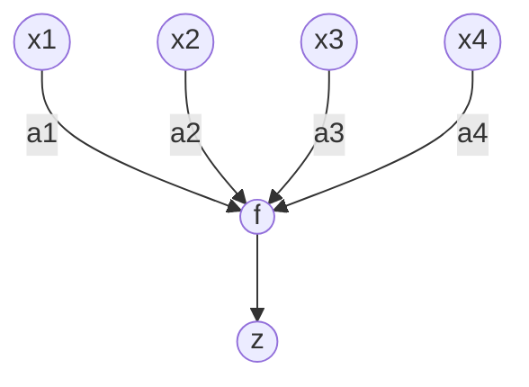

<b style="font-size: 0.85em;">수업 내용 보호를 위해 일부 생략된 내용이 있을 수 있습니다.</b> 

# **4. Method of Least Squares**

여기까지 최급강하법의 풀이를 이해하고 최소제곱법을 이용해서 투구 기록을 예측하는 선형 모델을 학습하는 프로그램을 작성했다. 여기에서는 이 해설의 본제인 뉴럴 네트워크로 v들어간다. 그전에, 뉴럴 네트워크에 대한 연구의 역사적 흐름을 보자.

*$[Fig.\,3]$ Output Function*

1943년, McCulloch와 Pitts는 $M$개의 두 값($\pm 1$)의 조합 $<x_1,x_2,...,x_M>$에서 두 개의 출력 y를 계산하는 신경세포(뉴런)를 임계 논리소자

$$
y=U\left(\sum_{i=1}^{M} a_{i} x_{i}+a_{0}\right)
$$

*$[33]$*

으로 모델화했다. 여기서 출력 함수로서 이용되는 $U(\eta)$는

$$
U(\eta)=\left\{\begin{array}{r}
1, \text { if } \eta>0 \\
-1, \text { if } \eta \leq 0
\end{array}\right.
$$

*$[34]$*

와 같은 임계 함수로 한다. $[Fig.\,3]$ (a)의 임계 함수를 나타낸다. McCulloch와 Pitts는 이와 같은 뉴런을 많이 상호 결합한 네트워크에 의해 임의의 논리 함수를 표현할 수 있다는 것을 나타낸다. 또한, 1949년에는 Hebb이 실제 신경회로를 조사해서 뉴런 간의 결합의 강도(결합 강도)는 뉴런의 입력과 출력이 모두 활성화 상태에 강화된다는 Hebb의 학습 법칙을 제안했다.

*$[Fig.\,4]$ Perceptron*

이와 같은 연구를 배경으로 해서 1957년, 심리학자 Rosenblatt는 세계 최초 패턴인식을 위한 학습 기계 모델을 제안했다. 이 모델은 퍼셉트론이라고 불리며 이후의 학습법의 규범이 되었다. $[Fig.\,4$]에 퍼셉트론의 개념을 그림으로 나타내었다. 퍼셉트론은 임계 논리소자를 노런 모델로 하여 망막에 해당하는 입력층, 거기서 랜덤으로 연결된 연합층, 그리고 연합층의 출력을 선형 가중합으로 모아서 출력을 내는 반응층 이 3개의 층으로 이루어진 뉴럴 네트워크 모델이다. 이 네트워크 모델에서는 입력층으로의 입력과 해당 입력에 대한 원하는 답(교사의 답)이 주어지면 연합층에서 반응층에 대한 결합 무게가 순차적으로 수정된다. Rosenblatt 학습법은 우선 네트워크에 입력 패턴을 분류시키고 그 결과가 교사의 답과 다르면 결합 무게를 수정하는 것이었다. 입력을 완전히 식별할 수 있는 과제에 대해서는 이 학습법을 반복하는 것으로 입력 패턴을 식별할 수 있다. 그러나 완전히 식별되지 않는 과제에 대해서는 아무리 반복해서 학습을 해도 해에 도달하지 못할 가능성이 있다.