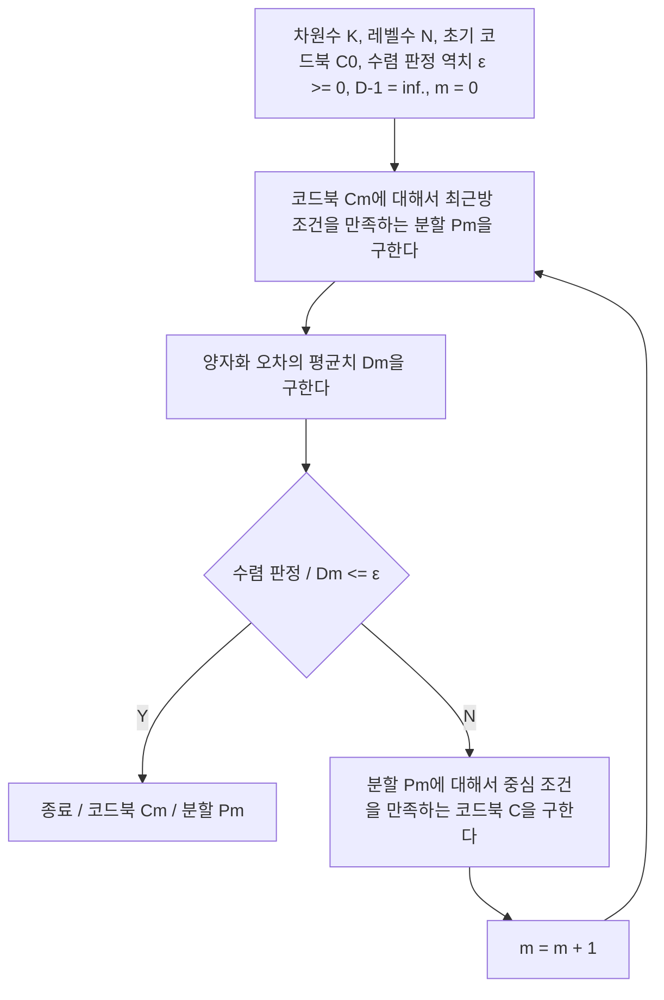
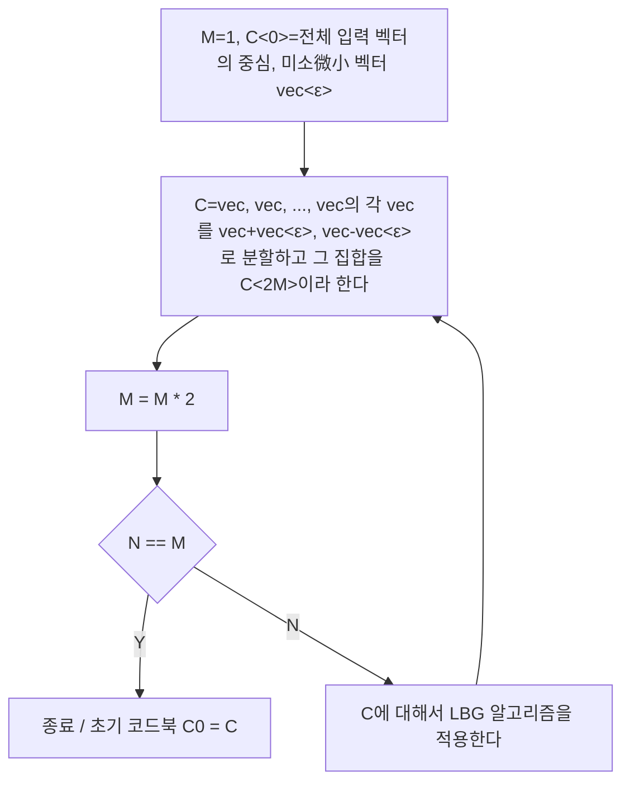

<b style="font-size: 0.85em;">수업 내용 보호를 위해 일부 생략된 내용이 있을 수 있습니다.</b> 

# **개요**

디지털 화상 처리에서는, 연속적인 수준의 아날로그 신호인 빛 호는 A/D변환에 따른 이산적인 값의 디지털 신호로 변환되고 분류된다. 아날로그 입력 신호를 진폭 방향으로 이산화하는 것, 혹은 이미 디지털화한 신호를 다른 정도의 디지털 신호로 바꾸는 것을 양자화라고 부른다. 양자화를 통해 디지털 신호로 함으로써 신호는 다루기 쉬워지지만, 원래는 아날로그의 연속량인 신호를 이산화하기 때문에, 아무리 긴 자릿수를 이용하더라도 양자화에 따라 반드시 반올림의 오차가 생긴다. 화상 부호화에서는, 양자화 처리에 의해서 화상 데이터를 압축하지만, 양자화 처리에 의해서 생기는 변형을 최대한 줄이는 것을 요구한다.

양자화에 의해서 생기는 오차를 해석하려면, 입력 신호의 성질에 근거하여 통계적으로 오차를 다룰 필요가 있다. 입력 신호의 통계적 성질이 기존의 경우에는 양자화 오차를 최소화하는 최적 양자화기를 설계할 수 있다. 그러나 영상 신호의 통계적 성질은 일반적으로 미지이다. 그래서 실제 화상 부호화의 양자화가 최적 양자화가 이용되는 것은 적으며, 엔트로피 부호화와의 조합으로 양자화 오차를 억제하면서 압축을 한다. 양자화에는 신호를 스칼라 값으로 취급 스칼라 양자화와, 벡터로서 복수의 신호를 다루는 벡터 양자화가 있고 양측 모두 화상 부호화에 적용된다. 또, 화상 부호화에서는, 인간의 시각 특성을 고려한 양자화를 실시하는 것이 특히 중요하다.

# **스칼라 양자화**

## **양자화와 양자화 오차**

양자화 처리로 연속적인 진폭 수준의 표본값은 필요한 정도로 둥글게 만들며, 여기저기의 이산치(양자화 수준이나 양자화 대푯값 등)로 교체된다. 입력 표본값을 보다 작은 수의 양자화 대푯값으로 바꿔서, 양자화 인덱스라고 부르는 식별 번호로 하는 것으로 데이터량의 압축이 가능하다. 오히려 양자화 처리에서는 복수의 양자화 대푯값 중에서 양자화된 인덱스에 해당하는 값을 출력한다.

표본별 양자화는 스칼라 양자화라고 불린다. $[Fig.\,1]$에서 나타내는 것처럼, 입력 표본치 $x_{i}\left(x_{0} < x_{1} < \cdots < x_{N-1}\right)$, 양자화 역치 $x_i$, 양자화에 의해 출력되는 양자화 대푯값를 $y_i$로 하고, 양자화 레벨수 N은 유한하다고 하면, 스칼라 양자화$Q(\cdot)$에 의해

$$
\min _{i}\left|x-y_{i}\right|
$$

*$[1]$*

을 만족하는 양자화 인덱스 $i(i=Q(x))$가 출력된다. 한편, 역양자화는 $i$를 입력으로 $y_i$을 출력하는 $\left(y_{i}=Q^{-1}(i)\right)$이다. 양자화의 반올림으로 $y_{i} \neq x$가 되는 경우 양자화의 입력과 역양자화의 출력에는 $e=x-Q^{-1}(Q(x))$가 생긴다. 이것을 양자화 오차 또는 양자화 잡음이라고 부른다.

*$[Fig.\,1]$ 스칼라 양자화와 양자화 오차*

양자화 대표값 $y_i$에 대응하는 입력 $x$의 구간을 $[x_(i-1), x_i]$라고 할 때 $\Delta_{i}=x_{i}-x_{i-1}$을 양자화 스텝폭이라고 부른다. 양자화 스텝폭이 $i$에 관계없이 같은 것을 선형 양자화, 동일하지 않은 것을 비선형 양자화라고 부른다. 또한 $[Fig.\,2]$와 같이 입력 $x = 0$이 있는 양자화 대푯값 $y_i$에 대응하고 있는 것을 미드트레드형, $[Fig.\,3]$과 같이 양자화 대푯값의 경계에 위치하는 것을 미들라이저형이라고 부른다. 또한 미소(微小) 레벨의 잡음 성분을 억제하기 위해 $[Fig.\,4]$에 나타나듯이 0 근방의 값을 0으로 말아 넣는 범위를 넓게 잡는 것을 데드존(deadzone)이 있는 양자화라고 부른다.

입출력 간의 양자화 오차 제곱 평균은

$$
E\left[e^{2}\right]=\sum_{i=1}^{N} \int_{x_{i-1}}^{x_{i}}\left(x-y_{i}\right)^{2} p(x) d x
$$

*$[2]$*

로 주어진다.

여기서 $p(x)$는 입력 표본값에 대한 확률 밀도 함수이다. 선형 양자화에서 레벨수 $N$이 충분히 컸으며 양자화 스텝 폭 $\Delta$ 범위 내에서 신호 분포가 동일하고 오차 평균값가 0으로 간주될 경우, 양자화 오차 제곱 평균은 다음과 같다.

$$
E\left[e^{2}\right]=\int_{-\frac{A}{2}}^{\frac{A}{2}}\left(x^{2} \frac{1}{\Delta}\right) d x=\frac{1}{12} \Delta^{2}
$$

*$[3]$*

*$[Fig.\,2]$ 미들트레드형 양자화*

*$[Fig.\,3]$ 미들라이저형 양자화*

*$[Fig.\,4]$ 데드존이 있는 양자화*

## **최적양자화 (Max 양자화기)**

레벨수 N이 주어졌을 때, 양자화 오차의 제곱 평균이 최소가 되는 양자화기를 최적 양자화기라고 부른다. 최적 양자화기의 양자화 역치 $x_i$ 및 양자화 대푯값 $y_i$는, 식$[1]$을 $x_i$ 및 $y_i$로 미분하여 0으로 두고, 이것을 푸는 것으로 얻어진다.

$$
x_{i}=\frac{y_{i}+y_{i+1}}{2}, i=1,2, \ldots, N-1
$$

*$[4]$*

$$
y_{i}=\frac{\int_{x_{i-1}}^{x_{i}} x p(x) d x}{\int_{x_{i-1}}^{x_{i}} p(x) d x}, i=1,2, \ldots, N
$$

*$[5]$*

즉, 최적 양자화기에서 양자화 역치 $x_i$는 양자화 대푯값간의 중앙에 위치하며, 각각의 양자화 대푯값 $y_i$는 양자화 역치간의 중심 위치가 된다.

임의의 확률 밀도 분포의 표본에 대하여, 식$[4]$, 식$[5]$를 이용하여 $x_i$ 및 $y_i$를 수치계산 등에 의해 반복하여 구하는 순서로 양자화 역치와 양자화 대푯값을 설계한 최적 양자화기를 Max 양자화기 혹은 Lloyd-Max 양자화기라고 부른다.

# **벡터 양자화**

## **벡터 양자화**

입력 표본값을 각각 독립적으로 양자화하는 스칼라 양자화에 대해, 벡터 양자화에서는 여러 입력 표본값을 한곳에 모아 양자화한다.

$K$차원 입력벡터를 $\vec{x}=\left(x_{1}, x_{2}, \cdots, x_{K}\right)^{T}$, 입력벡터가 존재하는 $K$차원 신호 공간을 $\mathbf{R}^{K}$라고 한다.. $\mathbf{R}^{K}$를 빈틈없이 겹치지 않고 $N$분할하는 분할을 $P = \[ P_1, P_2, \cdots, P_N \]$라고 한다. 입력 벡터 $\vec{x}$가 분할 $P_i$에 포할될 때, 벡터 양자화의 출력은 인덱스 $i$가 된다. ($Q(\vec{x})=i$) 양자화 대표벡터를 $\[ vec{y_1}, \vec{y_2}, \cdots, \vec{y_N} \], \vec{y_i} \in P_i$라고 하면, 벡터 역양자화의 출력은 인덱스에 대응한 양자화 대표벡터가 된다. ($\mathrm{Q}^{-1}(i)=\vec{y_i}$) 양자화 대표벡터의 집합 $\mathbf{C}=\[\vec{y_1}, \vec{y_2}, \cdots, \vec{y_N} \]$는 코드북이라고 불린다.

*$[Fig.\,5]$ 2차원 10레벨 벡터 양자화와 양자화 오차*

2차원 10레벨 벡터 양자화의 예시를 $[Fig.\,5]$에 내타내었다. 이 예시에서는 $\vec{x}$가 분할 $P_9$에 포함되어있으며, 벡터 양자화의 출력은 인덱스 9가 된다. 이것을 벡터 역양자화하면, 양자화 대표벡터 $\vec{y_9}$가 출력된다. 양자화 전후의 벡터의 차가 양자화 오차 $\mathrm{d}\left(\vec{x}, \vec{y_i}\right)$이다. 벡터 양자화기의 성능은 양자화 오차의 평균값으로 평가된다. 양자화 오파의 측도(測度)로서는 벡터간의 유클리드 거리의 제곱 ($\left(\sum_{j=1}^{K}\left(x_{j}-y_{i j}\right)^{2}\right)$) 등이 이용된다.

## **최적 벡터 양자화기**

벡터 양자화기는 코드북과 분할에 따라 설계된다. 입력 벡터 계열에 대한 양자화 오차의 평균을 최소로하는 최적 벡터 양자화기의 조건은 아래로 나타낸다.

최근방 조건: 각 분할은 $\mathrm{P}_{i}=\[vec{x} \mid \mathrm{d}\left(\vec{x}, \vec{y_i}\right) \leq \mathrm{d}\left(\vec{x}, \vec{y_j}\right), \text { for all } j \neq i\]
$를 만족한다.

중심 조건:각 출력 대표 벡터는 대응하는 분할의 중심 ($\vec{y_i}=\mathrm{E}\left[\vec{x} \mid \vec{x} \in \mathrm{P}_{i}\right]$)이다.

0 확률 경계 조건: 복수의 양자화 대표 벡터와 등거리에 있는 입력벡터가 존재하지 않는다.

## **LBG 알고리즘**

레벨수의 증가에 따라 최적 벡터 양자화기의 설계는 곤란해진다. 여기서는 양호한 벡터 양자화기의 설계법으로 알려진 LBG 알고리즘을 $[Fig.\,6]$에 나타낸다.

*$[Fig.\,6]$ LGB 알고리즘*

*$[Fig.\,7]$ 스플리팅 알고리즘*

LBG 알고리즘의 성능은 초기 코드북에 의존한다. 레벨수 $N$이 2의 거듭제곱일 때, 초기 코드북 작성에 이용 가능한 스플리팅 알고리즘을 $[Fig.\,7]$ 나타냈다.

[참고] 전자정보통신학회